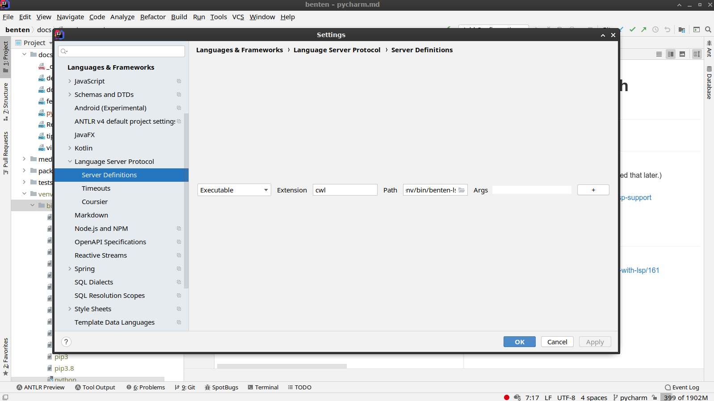
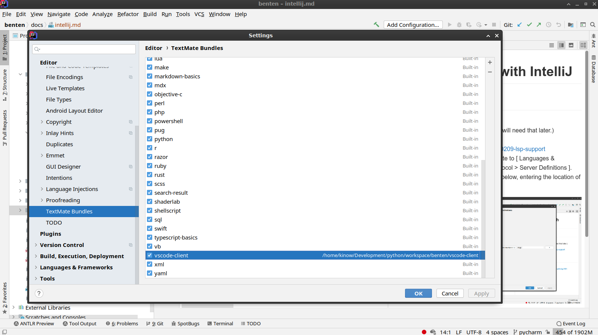
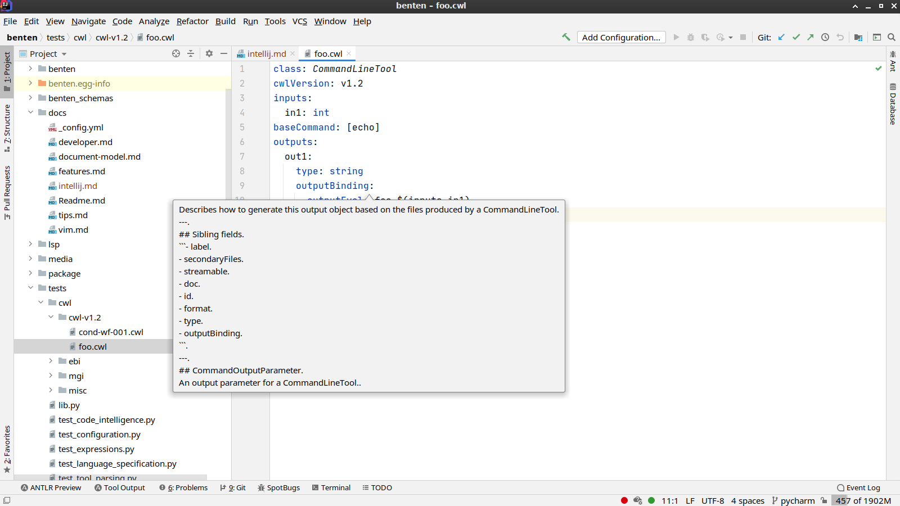

# Running Benten with IntelliJ

## Install 

1. Install Benten.
2. Find the location of `benten-ls` (you will need that later.)
3. Install the **LSP Support** plug-in: <https://plugins.jetbrains.com/plugin/10209-lsp-support>
4. Open the IntelliJ Settings, and navigate to [ Languages & Frameworks > Language Server Protocol > Server Definitions ].
5. Add an LSP entry as per screenshot below, entering the location of `benten-ls` found in step 2.

6. Finally, now navigate to [ Editor > TextMate Bundles ], click on the `+` (plus) sign, and select the directory of the `vscode-client` of Benten. You should see a new entry after you confirm your settings.

That's it, now you should be ready to open a CWL file with syntax highlighting and auto-complete.

>NOTE: Language Server Protocol is not natively supported in IntelliJ,
>so the installation notes here may need to be updated if the LSP Plug-in changes
>or if IntelliJ changes its API.

## References:

- Robot Framework, “PyCharm with LSP”: https://forum.robotframework.org/t/pycharm-with-lsp/161

