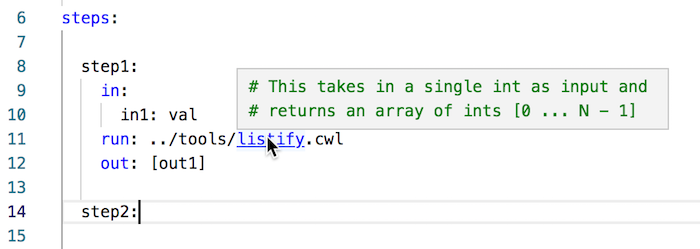

# Tips and Tricks


## Comments at top of file show in hover
When you hover over the path of a linked file in the `run` field of a
workflow step, editors (such as VS Code) may offer a preview of the
file. If you take the first few lines of the CWL to write up a synopsis
of what the CWL does, this will then be shown on hover.




## Autocomplete for the run field is a file picker
Typing in the `run` field of a step triggers an inline file picker.
Typing `.` will offer all CWL files and all sub-directories relative to
the current file. Typing `..` will offer all CWL files and
sub-directories one level up, and so on.
 

## Go to definition for run field
Employing the "go to definition" action on the run field will open the
linked CWL it refers to. 


## Configuration
The configuration file is found under
`$XDG_CONFIG_HOME/sevenbridges/benten/config.ini` (If `$XDG_CONFIG_HOME`
is not set, `$HOME/.config/sevenbridges/benten/` is used)

On first startup benten will create a default configuration file for
you. The configuration file is in the .ini format and is fairly
self-explanatory. The default file can be found
[here](../benten/000.package.data/config.ini)


## CWL language versions
The language model is created directly from the language specification.
The specification is found under `$XDG_CONFIG_HOME/sevenbridges/benten/`
and is named after the CWL version, such as `schema-v1.0.json` etc. The
`cwlVersion` tag in the document is used to infer which language
specification needs to be used. If no `cwlVersion` is found the latest
released specification is used.

The `schema-X.json` files are created using the `schema-salad-tool`
using the `--print-avro` option e.g.

```
schema-salad-tool --print-avro ~/path/to/cwl/schemas/CommonWorkflowLanguage.yml > schema.json
```


## Reporting bugs
Log files are found under `$XDG_DATA_HOME/sevenbridges/benten/logs` (If
`$XDG_DATA_HOME` is not set,
`$HOME/.local/share/sevenbridges/benten/logs` is used). The log from the
current run is `benten-ls.log`. Logs from previous runs are preserved in
a rotating fashion. These logs could be attached to bug reports as
needed. They do contain file names and paths.

