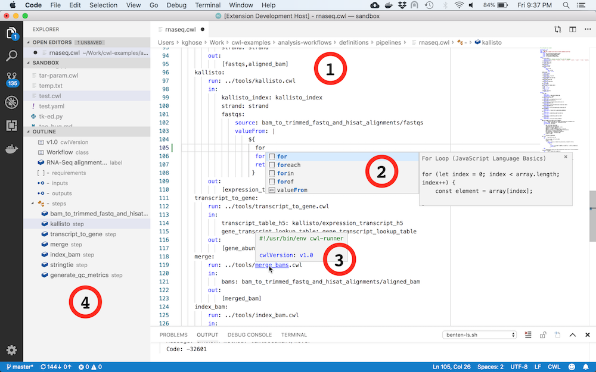

# Common Workflow Language extension for Visual Studio Code

This is an alpha release of CWL support in VS Code via the Benten CWL
[language server].

[language server]: https://langserver.org/


# Features



- CWL syntax highlighting, CWL grammar parsing _(1)_
- Embedded JS expression highlighting _(2)_
- Navigate to linked sub-workflows and `$include`s _(3)_
- Outline view (Symbols) + Step symbols _(4)_
- Code snippets for process types, inputs, requirements
- Error squiggles indicating YAML and CWL issues


# Server installation

This plugin requires the Benten CWL Language Server to be installed.

Benten requires [Python 3.7 or later](https://www.python.org/downloads/)

If you will be installing from source you will need
[git](https://git-scm.com/downloads) on your system

A neat way to install `benten` in a virtual env (isolating it from your
system python) and still be able to call it as a regular executable is
to use `pipx`

```
pip3 install pipx  # in case you don't have pipx
pipx install --spec git+https://github.com/rabix/benten.git benten
```

_Note: `pipx` installs the executables in `$HOME/.local/bin`
(%HOMEPATH%\.local\bin for Windows). This needs to be added to your PATH
env variable_

To install from develop branch (or some other branch): 
```
pipx install -spec git+https://github.com/rabix/benten.git@develop benten
```

Or, if you have cloned the repository and want to play with the server
code itself:

```
pipx install -e benten
```

<div align="right">
<sub>(c) 2019 Seven Bridges Genomics. Rabix is a registered trademark of Seven Bridges Genomics</sub>
</div>


